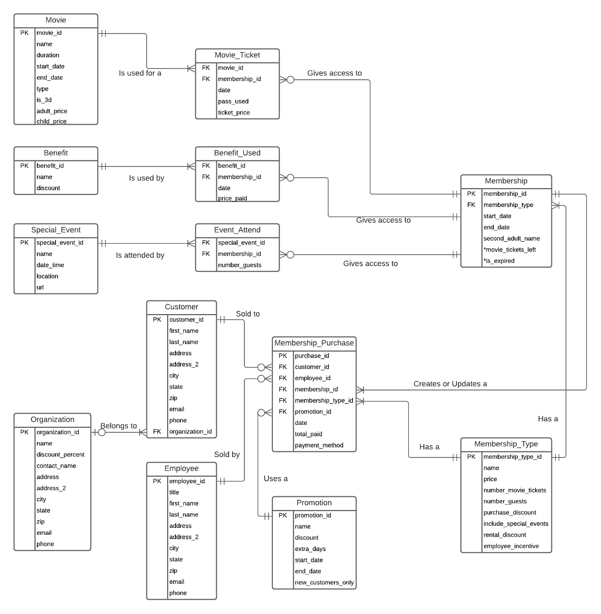
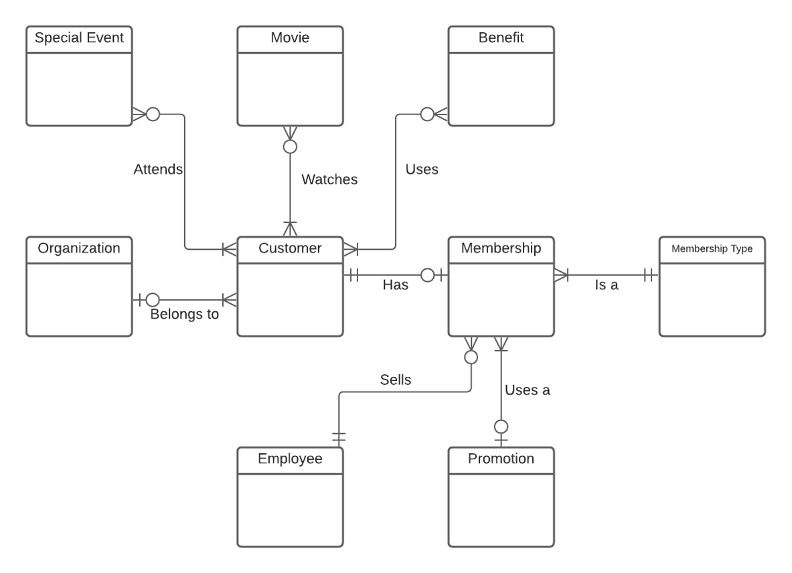

# David Bradshaw Database Final Project

This is the final project for Database Design and Development (INFO-639-01) class for Fall 2020 at Pratt Institute.

## Getting started

Run `npm install` then `npm run install:client`

## Running the server and client

Run `npm run start`.  This will run both at the same time (if one fails they will both stop). You can run individual items via `npm run client` or `npm run server`.

## SQL Commands

All SQL happens via the sql Class in the server.  By default expects to use school_user@localhost using password school_pass.  Which should have acccess to the database via `create_user.sql`.  Which can be created via the `create.sql` file in the sql directory.

## Business Rules

- A customer can have one active membership
- A membership can be one of four membership types
- A member type has specific benefits (number of movies, discounts, number of guests)
- An employee sale or renews memberships
- A member can visit the aquarium with number of quests allowed each day.
- A member can see movies with a pass or buy ticket
- A member can use benefits (parties, host event, gift shop discount, concession discount)
- A member can define a second user
- Members are invited to special events
- Members can attend special events (used for tracking most-active users)
- Members get a discount in the gift shop (track of usage as a benefit)
- Memberships expire after 365 days
- Memberships can be renewed early (adds 365 days to current expiration)
- Promotions are held sometimes to give extra month (31 days) for renewing with promo
- A customer may be part of one Organization and get discount
- An Employee earns an incentive for selling Memberships. Totals are paid out monthly.

## Supported Tasks

- Look Up Organization by name for Organization Discount
- Create a Customer
- Sell a membership at any level
- Check promotion code to ensure it is valid
- Check if membership is valid by scanning card or searching by phone, name or email
- Check if member has movie tickets when they purchase movies (customer does not have to use; can pay with cash).
- Query memberships expiring this month (for newsletter)
- Renew membership (including upgrading/downgrading)
- Query monthly incentives for employees (bonus pay)
- Record benefit usage (gift shop/concessions discount, birthday party discount, group rental discount)
- Record ticket purchases (and if used pass vs cash) – 1 pass is for 1 person
- Record member and guests (if any) attending special events.
- See how many quests are allowed per visit (per membership type)
- Query memberships that have not been renewed for end of year push
- Allow updating Customer information
- Query members who attend events heavily for marketing campaigns for upgrading to “Friend” or “Contributor” membership level
- Query customers who signed up with a corporate discount for reports to corporate sponsors on use by their employees
- Query active promotions

## Example of UI

[Example UI Video](./assets/example.mov)

## Logical Design

## Conceptual Design

